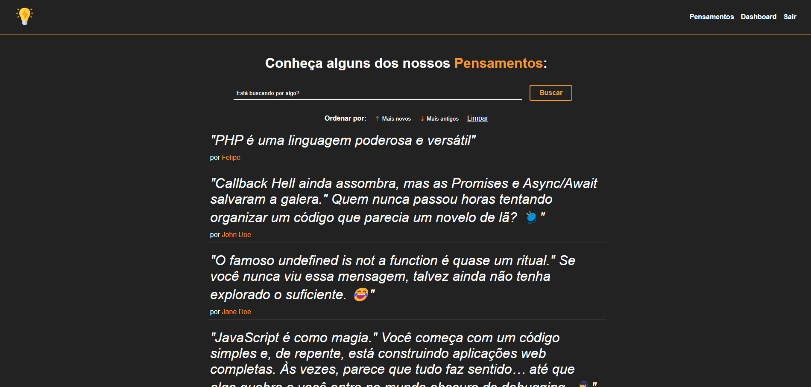

# Projeto-Toughts

## Descrição

Este projeto é uma aplicação **Node.js** que utiliza um banco de dados **MySQL** para construir uma plataforma similar a uma rede social. O sistema permite que os usuários se cadastrem, façam login autenticado e compartilhem posts de pensamentos, ideias ou reflexões, criando um espaço para expressar livremente o que quiserem.

Funcionalidades principais:
- **Cadastro de Usuário**: Crie uma conta com informações básicas.
- **Autenticação e Login**: Faça login com segurança para acessar seu perfil.
- **Postagem de Conteúdo**: Compartilhe seus pensamentos ou ideias com outros usuários.

## Tecnologias

- [Node.js](https://nodejs.org/) - Plataforma JavaScript usada para construir a aplicação.
- [Express](https://expressjs.com/) - Framework para construir APIs em Node.js.
- [Express Handlebars](https://www.npmjs.com/package/express-handlebars) - Motor de templates para renderizar páginas HTML dinâmicas.
- [MySQL](https://www.mysql.com/) - Sistema de gerenciamento de banco de dados relacional.
- [Sequelize](https://sequelize.org/) - ORM para conectar o Node.js ao MySQL (opcional).

## Pré-requisitos

Antes de iniciar, certifique-se de ter instalado o seguinte:

- **Node.js** (versão recomendada: 20.15.0 ou superior)
- **MySQL** (versão recomendada: 8.0 ou superior)
- **Git** (opcional, para clonar o repositório)

## Instalação

1. **Clone o repositório**

   git clone https://github.com/FelipeSDS23/Projeto-Toughts.git

2. **Instale as dependências**

    No diretório raiz do projeto, execute o comando:

    npm install

3. **Configure o banco de dados**   

    Crie um banco de dados MySQL com o nome desejado.
    Edite o arquivo contido no diretório db/conn.js com as credenciais do seu banco de dados:
    
    DB_HOST = localhost
    DB_USER = seu_usuario
    DB_PASSWORD = sua_senha
    DB_NAME = nome_do_banco_de_dados

Executando a aplicação

Para iniciar o servidor, execute:

npm start

A aplicação estará disponível em http://localhost:3000.

Contato
Caso tenha alguma dúvida ou sugestão, entre em contato:

LinkedIn: https://www.linkedin.com/in/felipe-santos-7296b8213/